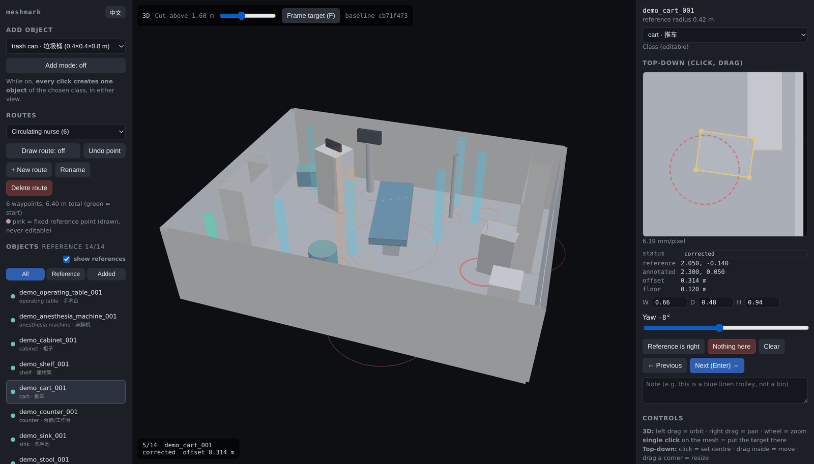

# meshmark

**Annotate objects and walking routes in a baked 3D scene, in your browser.**

[中文说明](README.zh.md)


<sub>A photogrammetry scan of a real operating room, annotated. Yellow: fitted boxes. Red: the positions a ground-truth file claims. Cyan: a person's route across the floor. The panel on the right is the same object seen from directly above, at 6.2 mm per pixel.</sub>

Point it at a mesh. Get a two-view annotator that writes oriented boxes, class
labels in English and Chinese, and named floor routes, as JSON.

```bash
npm install three                        # once, anywhere
pip install -e .
meshmark build examples/demo_room.glb --out .annotate/demo \
    --classes operating-room --targets examples/demo_room_targets.json
meshmark serve .annotate/demo --open
```

A demo room ships with the repo, so there is something to run before you have a
mesh of your own. Its floor sits at 0.12 m rather than 0, two objects touch, and
one reference position names an object that is not in the room -- finding that
out is the job.



No Blender. No preprocessing. No network — a built bundle is a static directory
that makes zero outbound requests.

---

## Why two views

Neither view alone is enough, and this is the whole design.

The **orthographic top-down plate** is where a position can be *measured*: an
exact world-to-pixel mapping, a printed millimetres-per-pixel figure, no
perspective to argue with.

The **3D view** is where an object can be *identified*, which the plate
frequently cannot do — a trash can and a stack of folded linen look much the
same from directly above.

Both write the same annotation. Click the mesh in 3D to place it, then nudge on
the plate with the arrow keys at centimetre resolution.

The plate is rendered from the mesh in the browser, so it re-renders when you
move the ceiling cut. Sliding the cut down reveals the floor underneath.

---

## What it gives you

- **Oriented boxes**, not just points. Drag a corner on the plate to fit width,
  depth and yaw; type a height.
- **Bilingual labels.** Every object carries both an English and a Chinese name,
  from the class preset, in every export. The UI switches with one button and
  remembers the choice.
- **Class presets** as JSON. Two ship (`generic`, `operating-room`); a third is
  a file you write and pass to `--classes`.
- **Optional reference positions.** Give it an existing ground truth with
  `--targets` and each position is drawn as a ring you confirm, correct, or mark
  absent. This is the workflow it was built for: not "where is the cart", but
  "is the cart where the file says it is".
- **Named routes** on the floor, as many as you like, each with its own colour
  and length.
- **Work is saved in the browser** as you go, keyed so that changing the
  reference positions gives a clean slate while routes survive a rebuild.

## What it does not do

- **It does not segment anything.** It is a manual annotator by design. If your
  mesh is a photogrammetry shell — one welded surface over the whole room — no
  clustering method will separate a cart from the wall behind it, which is the
  situation this was written for.
- **It does not measure heights.** Box height is a class default you can
  override. Widths, depths and yaws you drag are yours; heights are nominal, and
  the export does not pretend otherwise.
- **One scene, one person, one browser.** No server-side state, no accounts.

---

## Install

meshmark itself has **no Python dependencies**. It needs a copy of three.js to
put in the bundles it builds, and finds it in this order:

1. `--three /path/to/node_modules/three`
2. `$MESHMARK_THREE`
3. `./node_modules/three`, `~/node_modules/three`

```bash
npm install three          # in this directory is enough
pip install -e .
```

## Use

```bash
# an empty room, generic classes, English
meshmark build scan.glb --out .annotate/room

# an operating room in Chinese, against an existing ground truth,
# with the robot's start pose drawn as a fixed reference
meshmark build or_room.glb --out .annotate/or_room \
    --scene or_room \
    --classes operating-room \
    --lang zh \
    --targets gt_or_room.json \
    --reference "robot_start=-1.35,-1.9"

meshmark serve .annotate/or_room --open
```

`serve` binds to `127.0.0.1` and nothing else. A bundle contains a copy of
whatever mesh it was pointed at, which for a scan of a real room is not
something to put on a listening socket by accident.

### Inputs

| Format | Notes |
|---|---|
| `.glb` | One file, textures embedded. The easy case. |
| `.gltf` | Its buffer and images are found and staged alongside it. |
| `.obj` | Its `.mtl` and every texture the `.mtl` names come too, with the directory layout preserved. |

Large scans: `--link` symlinks the mesh instead of copying it.

### Controls

| | |
|---|---|
| 3D | left drag orbit · right drag pan · wheel zoom · **single click** places |
| Plate | click sets the centre · drag inside moves · drag a corner resizes |
| Keys | arrows nudge 1 cm (Shift 10 cm) · Enter next · F frame · Del remove |

---

## Output

```json
{
  "format": "meshmark/annotations",
  "version": 1,
  "scene": "or_room",
  "source": {
    "mesh": "or_room.glb",
    "floor_z_m": 0.1079,
    "floor_source": "measured from the mesh",
    "plate": { "pixels": 2048, "metres_per_pixel": 0.00333, "centre_xy": [0, 0] }
  },
  "objects": [
    {
      "object_id": "or_room_cart_001",
      "class_id": "cart",
      "label": "cart",
      "label_zh": "推车",
      "kind": "reference",
      "status": "corrected",
      "reference_xy": [-0.59, 1.18],
      "world_xy": [-0.7691, 1.2038],
      "footprint": { "width_m": 0.851, "depth_m": 0.481,
                     "height_m": 1.45, "yaw_deg": -69 },
      "offset_m": 0.1834,
      "note": ""
    }
  ],
  "routes": [
    { "id": "route_1", "name": "Route 1",
      "waypoints": [[-1.0, -2.0], [0.0, -1.0]], "length_m": 1.414 }
  ]
}
```

`status` is one of `pending`, `confirmed`, `corrected`, `absent`, `added`.

Anything in your `--targets` file that meshmark does not model is handed back
untouched under `source_fields`, so a round trip through the annotator loses
nothing.

### Reference files

`--targets` reads field names loosely, because every project spells them
differently. Any of `object_id` / `id` / `name`, any of `world_xy` / `xy` /
`position` / `world_xyz`, any of `footprint_radius_m` / `radius_m`. What it will
*not* do quietly: a file that yields zero usable positions is an error, and so
are duplicate ids — ids key your saved work, so two targets sharing one would
overwrite each other's annotation.

### Class presets

```json
{
  "name": "warehouse",
  "display": { "en": "Warehouse", "zh": "仓库" },
  "classes": [
    { "id": "pallet", "en": "pallet", "zh": "托盘", "size_m": [1.2, 0.8, 0.15] }
  ]
}
```

Both languages are required. A missing `zh` is a build error rather than a
silent fallback, because a UI that looks translated and is not is worse than one
that refuses to build.

Sizes are nominal, so placing an object is one click instead of one click plus
three number entries. Every box is meant to be dragged to fit.

---

## Two things that are checked rather than assumed

**The floor is found, not assumed to be zero.** meshmark takes the largest
horizontal slab in the lowest metre of geometry, weighted by area rather than
triangle count — a finely tessellated tabletop has far more triangles than a
coarse floor. The two rooms this was built on sit at 108 mm and 171 mm, both
loaded at the origin; an absolute cut that clears one slices into the other, and
the resulting error reads as "that object is oddly short" rather than as a bug.
Override with `--floor` if you know better.

**The plate's mapping is verified against a probe at startup.** A flipped axis
produces annotations that look entirely reasonable and are mirrored, which no
visual review catches. On load, meshmark renders a marker at a known asymmetric
position and checks it lands where the mapping predicts, then logs the error:

```
meshmark: plate mapping verified to 0.89 px (3.0 mm)
```

If it does not match, that is a console error, not a silent success.

---

## Tests

```bash
python -m pytest          # includes the JavaScript, via node
npm test                  # the JavaScript alone
```

The JavaScript lives in `.js` files rather than inside a Python string, and that
is not tidiness. This tool grew out of one whose entire 900-line application was
a string literal in a Python file — so an identifier deleted from one line and
still read on another was invisible to the interpreter, to linters, and to
tests. One duly shipped: it disabled the code that restored saved work, and the
page went on promising "a refresh does not lose it" while discarding every
annotation on load. `tests/js/store.test.mjs` opens with the test that fails if
it happens again.

## Licence

MIT — see [LICENSE](LICENSE), and [NOTICE](NOTICE) for what a built bundle contains.

Bundles you build contain a copy of three.js (also MIT) taken from your own
installation; three.js is not redistributed in this repository.
