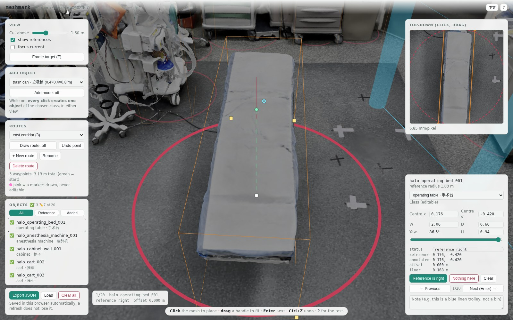

# meshmark

**在浏览器里，为扫描出来的房间手工标定物体和路线。**

[](https://github.com/Siiichenggg/meshmark/actions/workflows/test.yml)
[](LICENSE)
[](pyproject.toml)

[English](README.md)



<sub>一间手术室的摄影测量扫描，标注进行中。黄色：画在物体上的包围盒。红色：参考文件声称的位置。青色：在地面上画出的一条路线。右上：同一个物体的正上方视图，6.9 毫米/像素。</sub>

meshmark 把一份房间的三维扫描变成一个网页：你在上面给物体画带朝向的包围盒、
在地面上画路线，然后把两者导出成 JSON，坐标用的是网格自己的坐标系。

它是为室内机器人导航做的 —— 那种需要知道家具在哪、人从哪儿走的工作。
它主要干的是**核对**：给它一份声称物体在哪的文件，它把每一条声称摆到几何体旁边，
让你确认、修正、或者记下「这儿没东西」。空房间也能用，只是没什么可核对的，
全都是新增。

依赖：Python 3.10+，以及一份 three.js。不需要 Blender，不需要 GPU，不联网 ——
构建出来的包是一个静态目录，运行时不发出任何对外请求。

## 快速开始

```bash
npm install three          # meshmark 会把它复制进每个构建出来的包里
pip install -e .

meshmark build examples/demo_room.glb --out .annotate/demo \
    --classes operating-room --targets examples/demo_room_targets.json
meshmark serve .annotate/demo --open
```

仓库自带一个演示房间，让你在有自己的扫描之前就有东西可标。它是**故意**做得跟
真实房间一样难缠的：地面在 0.12 m 而不是 0，有天花板挡住俯视，两个物体贴在一起，
而且十四个参考位置里有一个指向的物体房间里根本没有。

## 两个视图

**俯视图**是用来量的。它是从正上方对扫描做的正交渲染，世界坐标到像素的映射是
精确的，比例尺就印在下面，所以位置可以直接读出来，没有透视变形。

**3D 视图**是用来认的。从正上方看，一个垃圾桶和一摞叠好的布单是同一个灰色圆圈，
你得从侧面看才分得出来。

两个视图编辑的是同一份标注。在 3D 里点击网格把包围盒放下去；此后它就在原地编辑，
靠框上的手柄：中心点拖着走、四个角点改尺寸、边外那个圆环转朝向、顶上的菱形沿竖直
导轨把高度拉起来。点在裸网格上只会放下**还没有位置**的那个框，所以往远处墙上误点
一下，不会把你已经调好的框传送走。俯视图是量最后一厘米的地方：在那儿拖，或者用
方向键一次 1 厘米地微调。

两个视图都会隐藏**切面**以上的一切 —— 切面是地面之上的一个高度，由
`--cut-height` 设定，也可以拖滑块调。没有它你看到的就只是天花板。
俯视图会在切面移动时重新渲染，所以往下拉就能看见原先被挡住的东西。

## 对着一份已有的文件核对

用 `--targets` 传进一份位置文件，每个位置会画成一个红圈。然后你为每个物体记下：

| 状态 | 含义 |
|---|---|
| `confirmed` | 参考位置是对的；标注直接取它的坐标 |
| `corrected` | 物体其实在这儿；`offset_m` 记录挪了多远 |
| `absent` | 那个位置上什么都没有 |
| `added` | 你发现的、文件里没提的物体 |
| `pending` | 还没看 |

你新增的物体没有圈也没有参考位置。来自文件的物体保留它的参考位置，
所以任何时候都能和原文件做差分。

记下 `confirmed` 或 `absent` 就意味着这个物体这一轮到此为止，于是它会自动跳到下一个
还没被判定过的物体，绕一圈；一圈下来没有就停在原地。否则一百个物体的一轮核对，
就要额外点一百次「下一个」。

**`--targets` 和 `--marker` 是两回事。** `--targets` 是你要核对、要编辑的位置。
`--marker` 是一个画成粉色、不可编辑的固定点 —— 机器人起始位姿、一个门口、
任何用来衡量路线的参照。

## 它不做什么

- **它不替你找物体。** 它按设计就是手动标定器。摄影测量扫描通常是整个房间
  蒙一层焊死的连续曲面，没有任何聚类方法能把推车和它背后的墙分开。
  `meshmark fit` 只会围着你已经给出的位置拟合一个框，它永远不会发现一个。
- **它不替你做判断。** 宽、深、朝向是你拖到物体上的，高度现在也可以 ——
  框顶的菱形沿一条竖直导轨往上拉，拉到框刚好罩住物体为止。`meshmark fit`
  能把这四个数都从网格上读出来，但它写下的是**提案**：它以待复核的状态进入
  队列，没有任何一条被标成已处理。导出里的 `height_source` 会写明这个高度是
  四种来源中的哪一种 —— 拖到网格上量出来的数、程序拟合出来的数，
  和从来没人看过的数，不该被同样地引用。
- **一个房间、一个人、一个浏览器。** 没有服务端，没有账号，不能合并。

## 安装

meshmark 本身没有 Python 依赖。它需要一份 three.js 放进构建出来的包里，
按下列顺序寻找：

1. `--three /path/to/node_modules/three`
2. `$MESHMARK_THREE`
3. `./node_modules/three`，然后 `~/node_modules/three`

## 用法

```bash
# 空房间，通用类别
meshmark build scan.glb --out .annotate/room

# 手术室，中文界面，对着已有文件核对，并把机器人起始位姿画成固定标记
meshmark build or_room.glb --out .annotate/or_room \
    --name or_room \
    --classes operating-room \
    --lang zh \
    --targets gt_or_room.json \
    --marker "robot start=-1.35,-1.9"

meshmark serve .annotate/or_room --open

# 先围着这些位置各拟合一个框，然后让标定器打开在提案上，而不是打开在空圈上
meshmark fit or_room.glb --targets gt_or_room.json \
    --classes operating-room \
    --out proposals.json
meshmark build or_room.glb --out .annotate/or_room \
    --targets gt_or_room.json --preload proposals.json
```

### `meshmark build`

| 选项 | 默认 | 作用 |
|---|---|---|
| `--out` | *必填* | 把包写到哪个目录 |
| `--name` | 网格文件名 | 这个房间的名字。浏览器按它存放你的工作 |
| `--classes` | `generic` | 内置预设名，或者你自己那份 JSON 的路径 |
| `--targets` | — | 要核对的位置，JSON。每个会画成一个红圈 |
| `--marker` | — | `NAME=X,Y`，画成粉色且不可编辑。可重复 |
| `--lang` | `en` | `en` 或 `zh`，给还没选过语言的浏览器用。页面里的切换优先，并且会被记住 |
| `--floor` | *自动检测* | 地面高度（米）。不填就从网格里找出来 |
| `--cut-height` | `1.6` | 在地面以上多少米把上面的一切隐藏掉，两个视图都生效 |
| `--top-down-pixels` | `2048` | 俯视渲染的分辨率 |
| `--preload` | — | 浏览器里没有存档时，用来打开的一份导出文件 |
| `--three` | *自动搜索* | three.js 包目录的路径 |
| `--link` | 关 | 用符号链接代替复制网格。给大扫描用 |

### `meshmark fit`

围着 targets 文件里的每一个位置，对周围的几何拟合一个框，写成一份可以直接
交给 `--preload` 的标注文件。**它出提案，你做标注。** 它写出的每个物体都以
*待处理*状态到达，身上没有 status 字段，所以它们全都会以未处理的样子出现在
复核队列里 —— 一个到达时就已经标成"已确认"的框，是没有人会去打开的框。

它不替你找物体。指向空地板的位置会带着一句说明回来，没有框；空的 targets
文件什么也换不到。它自己拿不准的拟合 —— 拟到了框沿而不是本体、高度只是个
上界而不是读数、形状离类别预设期待的差得远 —— 会在文件里被标出来，
并计入摘要。

| 选项 | 默认 | 作用 |
|---|---|---|
| `--targets` | *必填* | 要围着拟合的位置。没有它就没有东西可拟合 |
| `--out` | *必填* | 把提案写进哪个标注文件 |
| `--classes` | `generic` | 预设，它的名义尺寸决定每个位置周围要裁多大的窗口 |
| `--name` | 网格文件名 | 这个房间的名字，会写进文件 |
| `--floor` | *自动检测* | 地面高度（米），不填就从网格里量出来 |
| `--z-max` | `2.5` | 忽略地面以上超过这个高度的几何，这样天花板永远不会被读成某个物体的顶 |

文件里还带着一段标定器会忽略的 `fit`：这次运行用的每一个阈值，以及每个物体
命中了哪些规则、高度置信度如何、是从多少个点拟合出来的。一份提案的寿命，
比造出它的那行命令长。

### `meshmark serve`

`meshmark serve <bundle> [--port 8731] [--open]`

只绑定 `127.0.0.1`。一个包里带着它所基于的那份扫描的副本，
而真实室内空间的扫描不该被意外暴露到网络上。

### 输入网格

| 格式 | 说明 |
|---|---|
| `.glb` | 单文件，贴图内嵌。最省事的情况。 |
| `.gltf` | 它的 buffer 和 image 会被找出来一起放进包里。 |
| `.obj` | 它的 `.mtl`、以及 `.mtl` 里点名的每一张贴图都会跟着走，目录结构原样保留。 |

其它扩展名会直接中止构建，并给出转换建议。

### 操作

| | |
|---|---|
| **3D** | 左键拖旋转 · 右键拖平移 · 滚轮缩放 · 点一下框就切到它 · 框上的手柄：中心移动 · 角点改尺寸 · 圆环转朝向 · 菱形调高 · 点裸网格放下还没有位置的目标 |
| **俯视** | 单击设中心 · 框内拖移动 · 拖角点改尺寸 |
| **键盘** | 方向键 1 cm（Shift 10 cm）· <kbd>Enter</kbd> 下一个 · <kbd>F</kbd> 回到目标 · <kbd>Del</kbd> 删除 · <kbd>Ctrl</kbd>+<kbd>Z</kbd> 撤销 |

物体列表上方的**只看当前**，让两个视图只画你正在编辑的那一个物体，拾取也只认它。
一屋子的框从人能站的任何角度看都是互相压着的，而正在编辑的那个必须看得清。
这个开关按浏览器记住，不跟着房间走。

你的工作随时存进浏览器的 `localStorage`。存放的键是房间名加上参考位置的摘要，
所以改了参考文件就会得到一块干净的画布，而不是一堆压在已经挪走的圈上的旧框。
路线只按房间名存放，重建不会丢。

## 格式

<details>
<summary><b>你导出的是什么</b> —— <code>meshmark/annotations</code></summary>

```json
{
  "format": "meshmark/annotations",
  "version": 1,
  "scene": "or_room",
  "source": {
    "mesh": "or_room.glb",
    "floor_z_m": 0.1079,
    "floor_source": "measured from the mesh",
    "top_down": { "pixels": 2048, "metres_per_pixel": 0.00333, "centre_xy": [0, 0] }
  },
  "objects": [
    {
      "object_id": "or_room_cart_001",
      "class_id": "cart",
      "label": "cart",
      "label_zh": "推车",
      "kind": "reference",
      "status": "corrected",
      "reference_xy": [-0.59, 1.18],
      "world_xy": [-0.7691, 1.2038],
      "box": { "width_m": 0.851, "depth_m": 0.481,
               "height_m": 1.45, "yaw_deg": -69,
               "height_source": "class default" },
      "offset_m": 0.1834,
      "note": ""
    }
  ],
  "routes": [
    { "id": "route_1", "name": "Route 1",
      "waypoints": [[-1.0, -2.0], [0.0, -1.0]], "length_m": 1.414 }
  ]
}
```

| 字段 | 含义 |
|---|---|
| `kind` | 来自 `--targets` 就是 `reference`，你新建的就是 `added` |
| `world_xy` | 你把它放在哪 |
| `reference_xy` | 文件说它在哪。新增的物体没有这个字段 |
| `offset_m` | 上面两者之间的距离 |
| `box.yaw_deg` | 绕竖直轴的转角，单位度 |
| `box.height_source` | `class default`、`entered by hand`，或对着网格拖出来的 `dragged in 3D` |
| `source_fields` | 你的 `--targets` 文件里 meshmark 不理解的字段，原样还给你 |

坐标用的是**网格自己的坐标系**。进出都不做任何转换，所以导出的东西可以直接放回
生产这份网格的那一端。

</details>

<details>
<summary><b><code>--targets</code> 可以传什么</b></summary>

字段名读得很宽松，因为每个项目的拼法都不一样：

| 含义 | 以下任选 |
|---|---|
| 标识 | `object_id`、`id`、`name`、`object` |
| 位置 | `world_xy`、`xy`、`position_xy`、`position`、`world_xyz`、`xyz` |
| 半径 | `footprint_radius_m`、`radius_m`、`radius`、`arrival_radius_m` |
| 类别 | `label`、`class`、`category`、`type` |

```json
{"objects": [
  {"object_id": "cart_001", "label": "trolley",
   "world_xy": [2.05, -0.14], "footprint_radius_m": 0.42, "dynamic": true}
]}
```

有两件事它宁可报错也不猜：一是解析下来没有任何可用位置的文件，
二是重复的 id —— id 是你保存工作的键，两个物体共用一个会互相覆盖对方的标注。

</details>

<details>
<summary><b>类别预设</b> —— 房间不是手术室的时候</summary>

```json
{
  "name": "warehouse",
  "display": { "en": "Warehouse", "zh": "仓库" },
  "classes": [
    { "id": "pallet", "en": "pallet", "zh": "托盘", "size_m": [1.2, 0.8, 0.15],
      "aliases": ["skid"] }
  ]
}
```

`size_m` 是 `[宽, 深, 高]`，单位米，是一个**起始尺寸** ——
它让放置一个物体只需点一下，而不是点一下再填三个数字。

`aliases` 让一个类别认领参考文件里会用到的其它叫法，于是 `operating table`
也认 `operating bed`，而不是多出第二个类别。匹配不上任何类别的标签会被当作
一个新类别加进来，而不是被悄悄改写成别的。

`en` 和 `zh` 都是必填的；一个别名被两个类别同时认领会被拒绝。
完整例子见 [`examples/warehouse.json`](examples/warehouse.json)。

</details>

## 两个是量出来、而不是猜出来的数

**地面。** meshmark 取最低一米几何里面积最大的水平层，按**表面积**加权 ——
这样一张精细剖分的桌面就压不过一块粗糙的地板。扫描出来的房间很少正好在 z = 0，
本工具开发时用的两个房间分别在 108 mm 和 171 mm，而从错误的地面量起的切面高度，
会在整个房间里都差这么多。要覆盖它就用 `--floor`。

**俯视映射。** 加载时 meshmark 会在一个已知的非对称位置渲染一个标记，
检查它是否落在映射预测的那个像素上，并把误差打进浏览器 console：

```
meshmark: top-down mapping verified to 0.89 px (3.0 mm)
```

坐标轴一旦镜像，产生的标注看起来会完全合理，所以这件事每次加载都查一遍，
而不是想当然。

## 开发

```
src/meshmark/          CLI、打包、预设、参考文件、three.js 依赖
src/meshmark/web/      标定器本体：app、俯视渲染、geometry、存储、i18n
src/meshmark/presets/  generic.json、operating-room.json
examples/              demo_room.glb 以及生成它的 Blender 脚本
tests/                 Python；tests/js/ 在 node 里跑
```

```bash
python -m pytest          # 全部，包含通过 node 跑的 JavaScript
npm test                  # 只跑 JavaScript
```

JavaScript 放在 `.js` 文件里，而不是嵌在 Python 字符串里，这样它才能被解析、
被 lint、被单元测试。`tests/js/` 覆盖的是其中不碰 DOM 的部分：
地面检测、包围盒几何、存储层、以及翻译表。

早期阶段 —— 0.3.1。上面这些格式都带版本号，所以一旦有破坏性改动，它会自己声明。

## 许可

MIT —— 见 [LICENSE](LICENSE)，构建产物包含什么见 [NOTICE](NOTICE)。
你构建出来的包里包含一份 three.js（同为 MIT），取自你自己的安装；
本仓库不再分发它。
